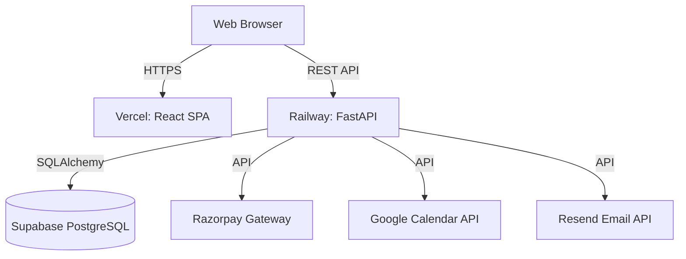
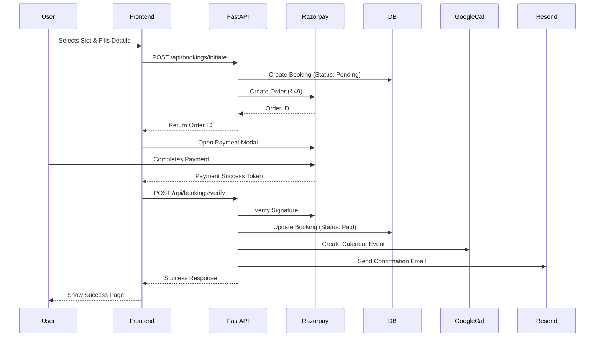

# Architecture

## High-Level Architecture
Quick Strength follows a decoupled, modern web architecture pattern comprising a statically hosted Single Page Application (SPA), a RESTful API backend, and a managed PostgreSQL database.



## Frontend Architecture
- **Framework**: React 19 with Vite for fast HMR and optimized builds.
- **State Management**: TanStack Query (React Query) for server state (data fetching, caching, synchronization). React Hook Form for local form state.
- **Routing**: React Router for client-side navigation.
- **Styling**: Tailwind CSS v4 coupled with shadcn/ui for accessible, unstyled components that we can heavily customize.
- **Animations**: Framer Motion for premium micro-interactions and scroll reveals.

## Backend Architecture
- **Framework**: FastAPI (Python) for high performance, automatic OpenAPI documentation, and robust type validation.
- **Database ORM**: SQLAlchemy 2.0 (async preferred or standard sync depending on load) with Alembic for migrations.
- **Data Validation**: Pydantic v2 for request/response schemas and environment variable validation.
- **Layered Design**:
  - **Routers/Controllers**: Handle HTTP requests and responses.
  - **Services**: Contain business logic (e.g., booking creation, payment verification).
  - **Repositories/Data Access**: Handle database interactions via SQLAlchemy.

## Data Flow: Booking a Trial


## Deployment Architecture
- **Frontend**: Deployed on **Vercel**. Provides edge caching, automatic CI/CD from GitHub, and PR preview environments.
- **Backend**: Deployed on **Railway**. Easy deployment for Python/Docker applications, handles environment variables securely, and offers simple scaling.
- **Database**: **Supabase** (Managed PostgreSQL). Provides connection pooling (PgBouncer) which is crucial for serverless/edge environments.

## Folder Structure (High Level)
```text
quick-strength/
├── frontend/             # Vite + React App
│   ├── public/
│   ├── src/
│   │   ├── assets/       # Images, global css
│   │   ├── components/   # Shared UI components (shadcn)
│   │   ├── features/     # Feature-based modules (landing, booking, admin)
│   │   ├── hooks/        # Custom React hooks
│   │   ├── lib/          # Utilities, API client configuration
│   │   ├── routes/       # Route definitions
│   │   └── store/        # Global state (if any)
│   └── package.json
│
├── backend/              # FastAPI App
│   ├── alembic/          # Database migrations
│   ├── app/
│   │   ├── api/          # Routers and endpoints
│   │   ├── core/         # Config, security, database setup
│   │   ├── models/       # SQLAlchemy models
│   │   ├── schemas/      # Pydantic models
│   │   ├── services/     # Business logic layer
│   │   └── utils/        # Helper functions
│   ├── main.py           # Application entry point
│   ├── requirements.txt  # Python dependencies
│   └── alembic.ini
│
└── docs/                 # Project documentation
```
