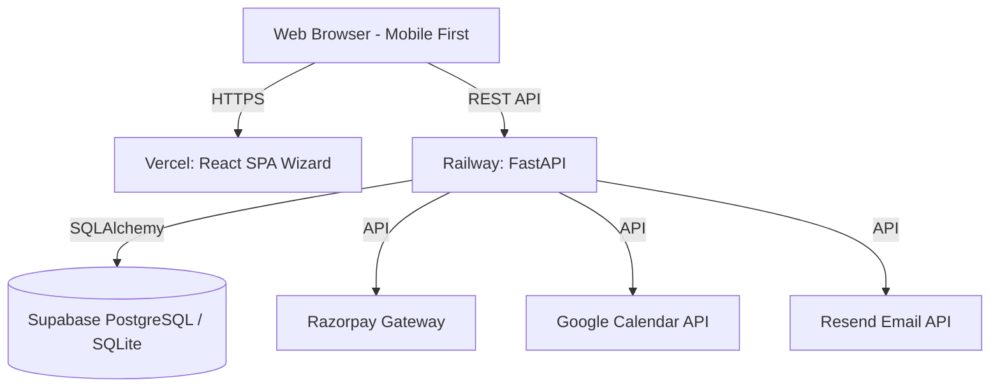
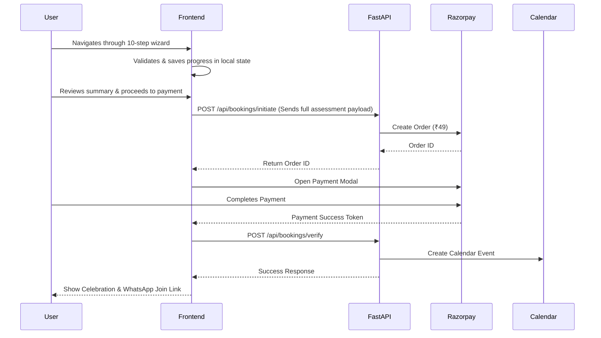

# Architecture

## High-Level Architecture
Quick Strength follows a decoupled, modern web architecture pattern comprising a statically hosted Single Page Application (SPA) designed as an onboarding wizard, a RESTful API backend, and a managed PostgreSQL database.

## Frontend Architecture (The Onboarding Wizard)
- **Framework**: React 19 with Vite.
- **State Management**: 
  - **Local State**: Context API or Zustand to maintain the onboarding wizard state across steps without losing data.
  - **Form Validation**: React Hook Form paired with Zod, validating step-by-step.
  - **Server State**: TanStack Query for data fetching (like fetching available slots) and mutations.
- **Styling**: Tailwind CSS v4 + shadcn/ui. Heavily customized for a premium, minimal aesthetic. 
- **Animations**: Framer Motion is critical here. It handles step transitions, micro-interactions, progress bar fills, and the final celebration screen.

## Backend Architecture
- **Framework**: FastAPI (Python) for high performance and strict type validation.
- **Database ORM**: SQLAlchemy 2.0 with Alembic for migrations.
- **Data Validation**: Pydantic v2 schemas map directly to the interactive onboarding steps.
- **Layered Design**:
  - **Routers**: Clean endpoints for wizard submission and payment verification.
  - **Services**: Business logic to handle the multi-step assessment payload, calendar syncing, and receipt generation.
  - **Repositories**: SQLAlchemy data access layers.

## Data Flow: Interactive Booking

## Deployment Architecture
- **Frontend**: Deployed on **Vercel**. Provides edge caching and instant PR previews.
- **Backend**: Deployed on **Railway**. Handles environment variables securely and scales easily.
- **Database**: **Supabase** (Managed PostgreSQL) for production, providing connection pooling (PgBouncer). Local development uses **SQLite** automatically via environment variables for zero-config onboarding.
