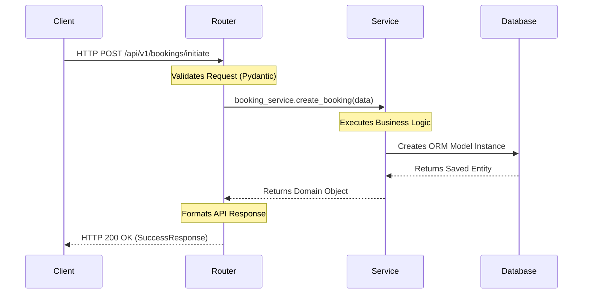
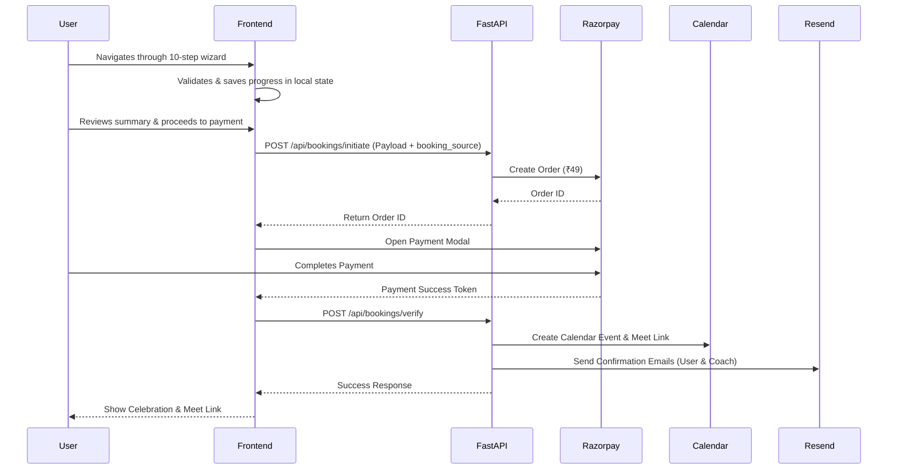

# Backend Architecture

## High-Level Architecture
The backend is a RESTful API serving the frontend SPA and connecting to a managed PostgreSQL database.

## Structure
- **Framework**: FastAPI (Python) for high performance and strict type validation.
- **Database ORM**: SQLAlchemy 2.0 with Alembic for migrations.
- **Data Validation**: Pydantic v2 schemas map directly to the interactive onboarding steps.
- **Strict Layered Design**: Business logic must never reside in FastAPI route handlers.
  1. **Routers Layer**: Exclusively handles HTTP requests, dependency injection, request validation via Pydantic, and returns formatted HTTP responses.
  2. **Service Layer**: Contains pure business logic. Orchestrates operations across multiple models, handles external API calls (e.g., Razorpay), and raises domain exceptions.
  3. **Database Layer**: Defines SQLAlchemy ORM structures and Pydantic validation schemas.
  4. **Core Layer**: Handles shared application configuration, custom exception definitions, and standardized API response formats.

## Request Lifecycle Flow

## Data Flow: Interactive Booking

## Architectural Constraints
Keep architecture intentionally lightweight. **Do not** introduce Redis, Celery, RabbitMQ, Kafka, WebSockets, Background workers, or Microservices. The project should remain simple until scale demands otherwise.

## Deployment Architecture
- **Backend**: Deployed on **Railway**. Handles environment variables securely and scales easily.
- **Database**: **Supabase** (Managed PostgreSQL) for production, providing connection pooling (PgBouncer). Local development uses **SQLite** automatically via environment variables for zero-config onboarding.
